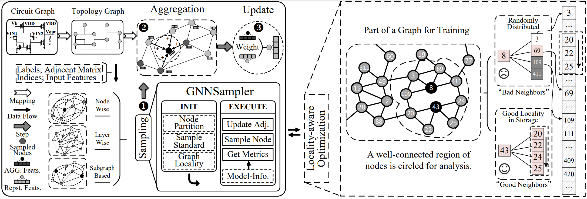

# GNNSampler: Bridging the Gap between Sampling Algorithms of GNN and Hardware
An implementation of the locality-aware optimization in GNNSampler. It can be plugged into the pre-processing step to accelerate the sampling process for sampling-based models. Since the paper is under review, more scripts designed to flexibly adjust the sampling weight will be open-sourced after acceptance.

## Overview
GNNSampler is a unified programming model for mainstream sampling algorithms, which covers key procedures in the general sampling process. One can embed GNNSamlper into the general sampling process to learn large-scale graphs. The following figure describes the workflow of learning large-scale graph data with GNN, where GNNSampler is embedded for optimizing sampling. Moreover, to leverage the hardware feature, we choose the data locality as a case study and implement locality-aware optimizations in GNNSampler. The right part of the figure illustrates a case for data locality exploration. More details can be found in our paper. <br><br>


## Experimental Devices
| Platform | Configuration |
|---|---
| CPU | Intel Xeon E5-2683 v3 CPUs (dual 14-core) |
| GPU | NVIDIA Tesla V100 GPU (16 GB memory) |

## Dependencies
* python
* tensorflow
* numpy
* scipy
* scikit-learn
* pyyaml

## Usage
One can use the following shell scripts to perform accelerated model training with locality-aware optimization: <br>
`./locality_amazon.sh` <br>
`./locality_reddit.sh` <br>
`./locality_flickr.sh` <br>
For comparison, one can use the following shell scripts to perform the vanilla methods (with no locality-aware optimization): <br>
`./vanilla_amazon.sh` <br>
`./vanilla_reddit.sh` <br>
`./vanilla_flickr.sh` <br>

## Code Directory
```
GNNSampler/
│   README.md
│   locality_amazon.sh (One can perform optimized model training on Amazon dataset with GraphSAINT as the backbone)
|   vanilla_amazon.sh (One can perform vanilla model training on Amazon dataset with GraphSAINT as the backbone)
│   ...
└───graphsaint/ 
|   (We use the tensorflow-based implementation of GraphSAINT)
└───precomputed_weight/
|   (We offer pre-computed weights for some datasets to reproduce the performance reported in the paper)
└───train_config/
|   (The configurations of training are generally taken from backbone's repository)
└───data/
    (Pls. download and add datasets into this folder)
```

## Datasets
All datasets used in our papers are available:
* [Pubmed](https://github.com/tkipf/gcn/tree/master/gcn/data)
* [PPI](https://github.com/williamleif/GraphSAGE/tree/master/example_data)
* [Reddit](https://github.com/williamleif/GraphSAGE/tree/master/example_data)
* [Flickr](https://drive.google.com/drive/folders/1apP2Qn8r6G0jQXykZHyNT6Lz2pgzcQyL)
* [Amazon](https://drive.google.com/drive/folders/1uc76iCxBnd0ntNliosYDHHUc_ouXv9Iv)


## Acknowledgements
The locality-aware optimization is embedded in various sampling-based models to verify its efficiency and effectiveness. We use the implementations of [GraphSAGE](https://github.com/williamleif/GraphSAGE), [FastGCN](https://github.com/matenure/FastGCN), and [GraphSAINT](https://github.com/GraphSAINT/GraphSAINT) as backbones, and owe many thanks to the authors for making their code available.
